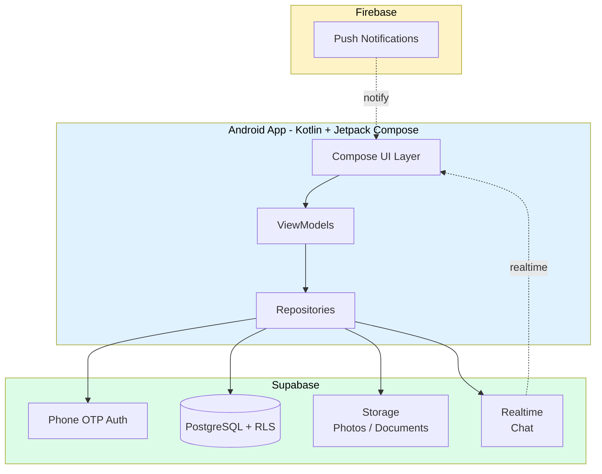

# Kaam

> **Verified home services for Kathmandu households — cleaning, childcare, and on-demand help.**
> Android-native app that connects customers with trust-verified workers, with realtime chat, transparent pricing, and a worker-side flow that respects the realities of Nepal's informal labour market.


---

## The problem

Hiring a cleaner, nanny, or handyperson in Kathmandu today happens through WhatsApp groups, Facebook posts, and word-of-mouth — opaque, unverified, and impossible to scale. Workers have no consistent way to surface their reputation; customers have no way to verify trust before letting someone into their home.

**Kaam closes that loop** with phone-OTP-verified workers, a structured profile system, realtime chat, and reviews — all in an Android-native experience designed for the network conditions and device capabilities common across Nepal.

## Architecture



**Single-Activity Compose architecture** with Navigation Compose for routing. **MVVM** pattern with **Hilt** dependency injection. Repository layer abstracts Supabase data access; realtime subscriptions push chat updates straight into the UI.

## Engineering decisions

| Concern | Choice | Rationale |
|---|---|---|
| Platform | **Android-native (not Flutter / RN)** | Tighter integration with Material 3, smaller APK, predictable performance on low-end devices common in Nepal |
| UI | **Jetpack Compose + Material 3** | Modern, less boilerplate; custom "Soft UI Evolution" theme on top |
| DI | **Hilt** | Compile-time safety; Compose-friendly |
| Backend | **Supabase** | Phone OTP out-of-the-box (critical for Nepal where phone is the primary identity), RLS for data isolation, realtime for chat |
| Auth | **Phone OTP** | No email-as-identity assumption; matches local UX expectations |
| Notifications | **Firebase FCM** | Reliable cross-vendor delivery; integrated with Supabase via edge function |
| Realtime | **Supabase Realtime** | Postgres-native subscriptions; no separate websocket server to operate |

## Key features

- **Phone OTP onboarding** with role selection (customer vs. worker)
- **Worker profiles** with verification status, portfolio photos, ratings
- **Discovery** — browse workers by service category, location, availability
- **Booking flow** — direct booking or post-job-and-receive-applications model
- **Realtime chat** between customers and workers
- **Reviews & ratings** for trust building
- **Push notifications** for booking updates, new applications, chat messages
- **Worker dashboard** with applications, bookings, earnings (in progress)

## Design system

Custom **Soft UI Evolution** design language built on Material 3:
- Cyan-anchored palette (`#06B6D4` primary)
- DM Sans typography (Regular, Medium, Semibold, Bold)
- Soft shadows, rounded geometry, generous spacing — designed to feel calm and trustworthy in a market where trust is the bottleneck

See `docs/superpowers/specs/2026-03-31-kaam-app-design.md` for the full design spec.

## Status

- **Project scaffold** complete (Phases 1–9 of the implementation plan)
- **Auth + onboarding flows** wired through to Supabase
- **Customer + worker journeys** in active development
- **Chat module** with realtime UI
- **Play Store listing** drafted

## Tech stack

**Mobile:** Kotlin 2.3.10, Jetpack Compose (BOM 2026.03.01), Material 3, Hilt 2.57.1, Navigation Compose 2.9.7
**Backend:** Supabase-kt 3.2.3, PostgreSQL with Row-Level Security, Supabase Storage, Supabase Realtime
**Networking:** Ktor + OkHttp 3.1.1
**Notifications:** Firebase Cloud Messaging
**Architecture:** MVVM with single-activity Compose + Hilt DI

## Local development

```bash
# Open in Android Studio
# Or via CLI:
./gradlew assembleDebug
./gradlew installDebug
```

Configure Supabase URL + anon key in `local.properties` (gitignored). Add `google-services.json` to `app/` for FCM (also gitignored).

Full implementation plan: `docs/superpowers/plans/2026-03-31-kaam-mvp.md` — phase-by-phase task breakdown for agentic execution.

## Roadmap

- [x] Project scaffolding, theming, navigation
- [x] Supabase backend + RLS policies
- [x] Auth & onboarding (phone OTP)
- [x] Worker profile system
- [x] Booking system (direct + applications)
- [x] Chat module
- [ ] Reviews & ratings — in progress
- [ ] Push notifications — wired, polishing
- [ ] Play Store launch — listing drafted

## About

Built by **Sadip Wagle** — AI Solutions Architect, formerly Co-Founder of **Datambit (London, 2023–2025)** with production AI experience for the **UK Home Office, Royal Navy, Mastercard,** and **Nationwide**. Currently based in Kathmandu, building indigenous AI products for Nepal.

- **LinkedIn:** [sadip-wagle](https://www.linkedin.com/in/sadip-wagle-711245b7/)
- **GitHub:** [@wsadip-tech-ai](https://github.com/wsadip-tech-ai)
- **Email:** waglesadip79@gmail.com

---

*Kaam is part of a portfolio of Nepal-first initiatives, alongside [Astra](https://github.com/wsadip-tech-ai/Astra) (astrology AI), [Pasal AI](https://github.com/wsadip-tech-ai/pasal-ai) (Nepali DM-commerce AI), [WedMe](https://github.com/wsadip-tech-ai/WedMe) (event direct-booking), and [PartyPour](https://github.com/wsadip-tech-ai/PartyPour) (event beverage planning).*
